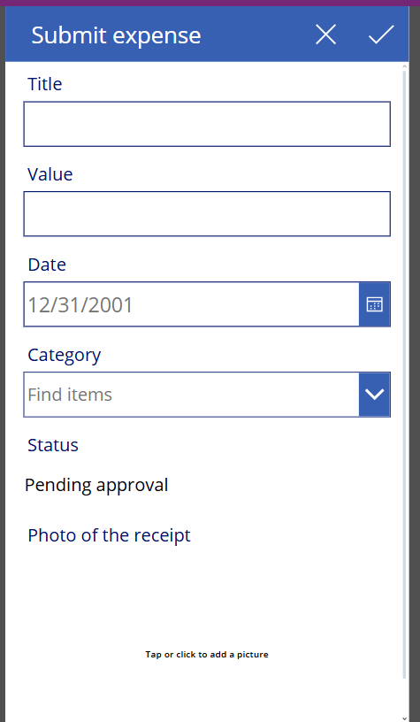
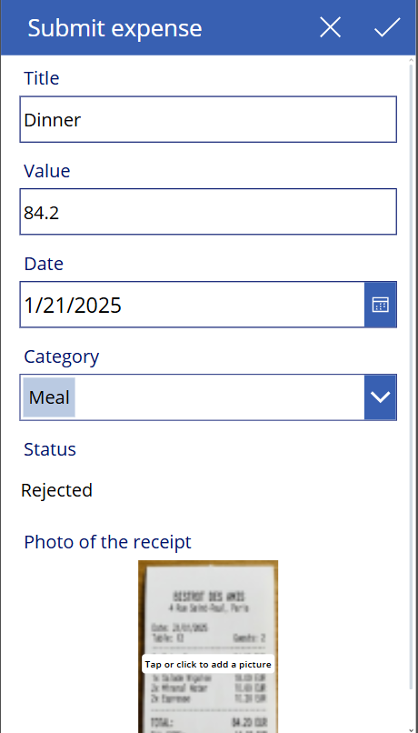
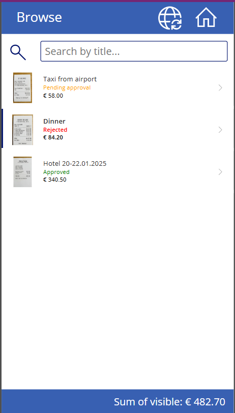
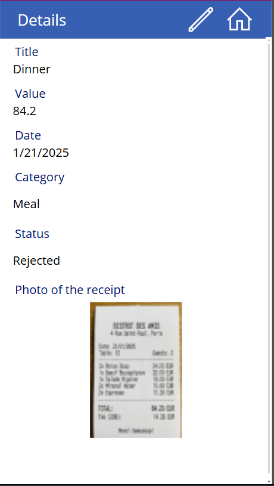
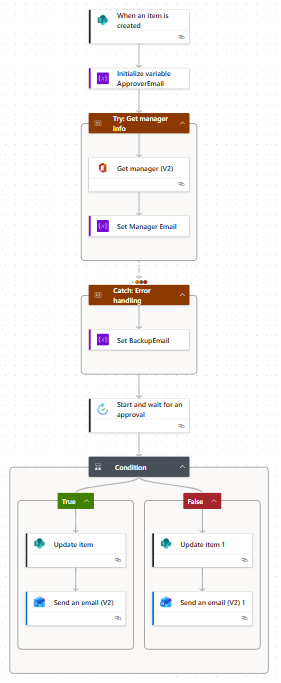
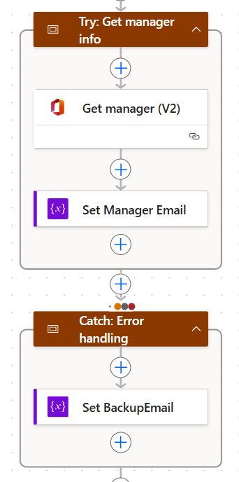

# PowerPlatform-Expense-Tracker

This is a personal project I built to practice creating end-to-end business solutions. The goal was to build a system where employees can submit expenses and managers can approve them, without using manual emails.

## How it works

I focused on making the app secure and "smart" so users don't make mistakes.

### 1. Smart Status Logic (Form Modes)
My main priority was data integrity. I didn't want users to manually set the status to "Approved".
* **Locked Field:** I set the Status field to `DisplayMode.View` in both New and Edit modes. This way, the user can see the status but never change it.
* **Auto-Status:** I used a formula to check the form mode.
    * If `FormMode.New`: The app forces the value to **"Pending approval"**.
    * If `FormMode.Edit`: The app displays the actual status from the SharePoint list (e.g., "Approved" or "Rejected").

### 2. Dynamic Approvals
Instead of hardcoding the approver's email, I used the **Office 365 Users connector**.
* The Power Automate flow looks up the manager of the person submitting the request.
* **Error Handling:** If a user doesn't have a manager assigned in AD, I used a "Try/Catch" scope in the flow to catch the error and send the request to a generic Finance email instead.

## Tech Stack
* **Power Apps:** Canvas app for the frontend.
* **SharePoint Online:** Used as the database.
* **Power Automate:** Handles the logic and approval emails.

---

## Note on Source Code
**Due to corporate compliance and data privacy policies, I cannot share the raw solution files (.zip).**
However, the screenshots below demonstrate the logic and UI I implemented.

---

## Project Gallery

### 1. Status Logic in Action
*In the "New Expense" screen, the status is automatically set to "Pending approval" and locked.*

*In the "Edit" screen, the status reflects the database value but remains locked for the user.*

### 2. Dashboard & Details
*Main gallery with conditional formatting (colors based on status).*

*Details view of a selected expense.*

### 3. Automation Flow
*The approval logic in Power Automate.*

*My error handling pattern (Try/Catch) for finding the manager.*

